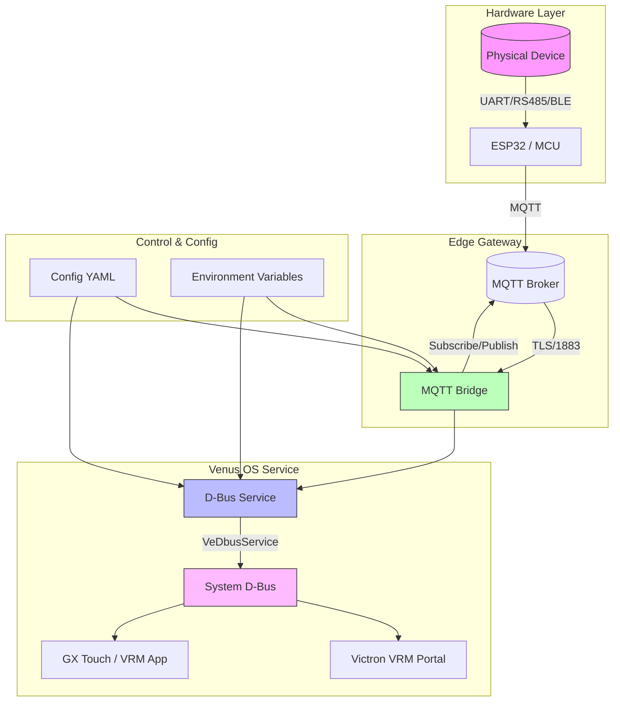
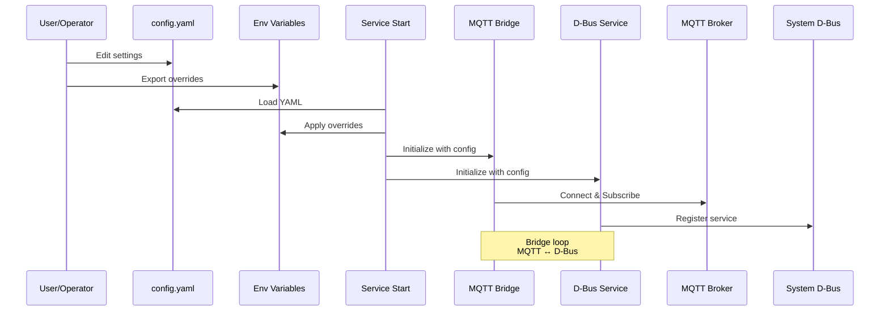
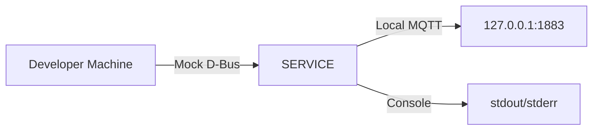
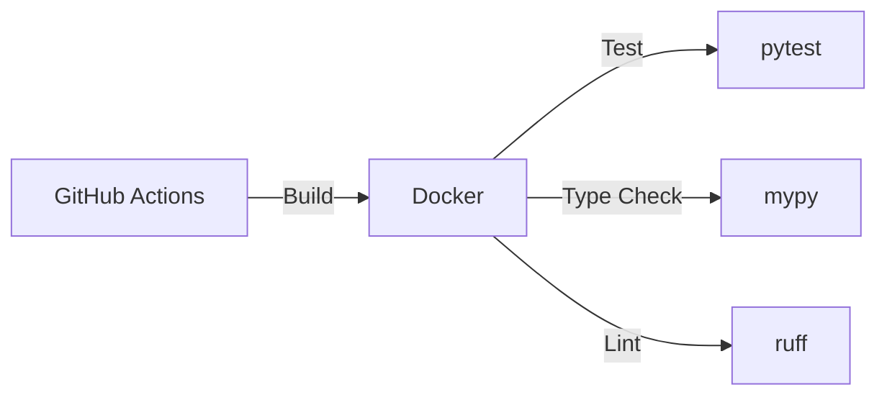
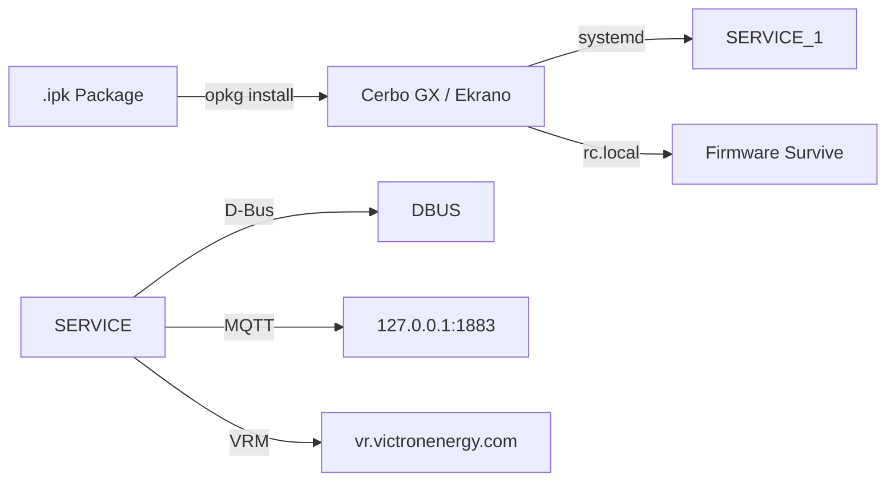
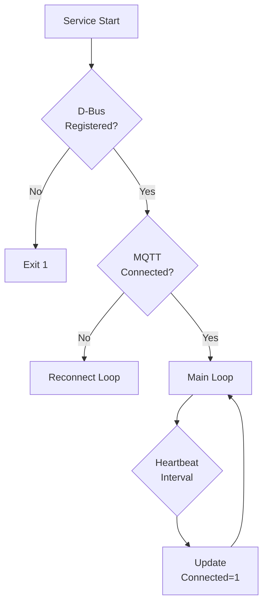

# System Architecture

## Overview

This document describes the system architecture for the **{{ project_name }}** D-Bus service targeting Victron Venus OS.

## Data Flow Architecture



## Component Details

### 1. Physical Device → Edge
- **Protocol**: UART, RS-485, BLE, Modbus RTU
- **Data**: Telemetry (voltage, current, power, SOC, temperature, alarms)
- **Frequency**: Configurable poll interval (default 1000ms)

### 2. MQTT Bridge (`mqtt_bridge.py`)
- **Library**: `paho-mqtt` (async, MQTT v5)
- **Features**:
  - Auto-reconnection with exponential backoff
  - Topic → D-Bus path mapping
  - SET topics for bidirectional control
  - Home Assistant MQTT Discovery (optional)
  - TLS/SSL support

### 3. D-Bus Service (`service.py`)
- **Framework**: `VeDbusService` (velib-python)
- **Paths**: Standard Victron + device-type specific
- **Methods**: GetValue, SetValue, GetStatus, Reboot
- **Signals**: PropertiesChanged (auto), custom signals

### 4. Venus OS Integration
- **D-Bus**: Registers under `com.victronenergy.<type>_<instance>`
- **VRM**: Auto-visible in VRM Portal
- **GUI**: GX Touch, VRM App, VictronConnect
- **Persistence**: systemd service, rc.local for firmware survival

## Configuration Flow



## Deployment Models

### Local Development


### Staging / CI


### Production (Venus OS)


## Runbook

### Service Management

| Action | Command |
|--------|---------|
| Start | `systemctl start {{ project_slug }}` |
| Stop | `systemctl stop {{ project_slug }}` |
| Restart | `systemctl restart {{ project_slug }}` |
| Status | `systemctl status {{ project_slug }}` |
| Logs | `journalctl -u {{ project_slug }} -f` |

### Configuration Changes

```bash
# Edit config
vim /etc/{{ project_slug }}/config.yaml

# Reload service
systemctl restart {{ project_slug }}
```

### Debugging

```bash
# Check D-Bus registration
dbus-send --system --dest={{ service_name }}.{{ device_type }}_{{ service_instance }} \
  --print-reply / org.freedesktop.DBus.Introspectable.Introspect

# Monitor D-Bus signals
dbus-monitor --system "destination='{{ service_name }}.{{ device_type }}_{{ service_instance }}'"

# Test MQTT connectivity
mosquitto_sub -h 127.0.0.1 -t "{{ topic_prefix }}/#" -v
```

### Common Issues

| Symptom | Cause | Fix |
|---------|-------|-----|
| Service won't start | MQTT broker unreachable | Check `--mqtt-broker`, firewall |
| Not in VRM | D-Bus not registered | Check `dbus-send` introspection |
| Config not applied | YAML syntax error | Validate with `yamllint` |
| Persistence lost | Missing rc.local entry | Re-run setup script |

## Health Checks



### Health Endpoints

- **D-Bus**: `/Connected = 1` when healthy
- **MQTT**: Will message on disconnect
- **Systemd**: `systemctl is-active`

---

*Generated from dbus-service-template*